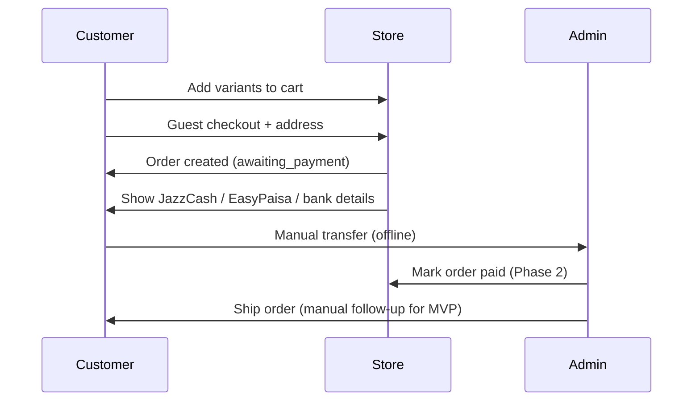

# Ecommerce Store — Locked Requirements

**Last updated:** 2026-05-19  
**Status:** Approved for MVP build

---

## 1. Business summary

Online store selling **physical goods** (e.g. shoes, blankets) in **Pakistani Rupees (PKR)**. Customers browse variants (size/color), check out as **guests**, and pay via **manual bank transfer** (JazzCash, EasyPaisa, or bank account). **One admin** manages products and orders.

---

## 2. Decisions (locked)

| Topic | Decision |
|-------|----------|
| Product type | Physical goods only |
| Variants | Size and color; each combination = **SKU** (own price/stock optional per SKU) |
| Customer accounts | **Guest checkout only** — no registration/login for buyers |
| Payments | **Manual transfer** — store shows JazzCash / EasyPaisa / bank details; buyer transfers offline; admin confirms payment |
| Currency | **PKR** — display as `Rs. 1,234` |
| Admin | **Single user** (store owner) |
| Design | Standard ecommerce layout (clean catalog, cart, checkout); no custom brand assets required for MVP |
| Stack | **Next.js**, **Tailwind CSS**, **SQLite** (dev) → PostgreSQL optional later |
| Build order | **MVP storefront first**, then admin dashboard |

---

## 3. MVP scope (Phase 1)

### In scope

- Responsive storefront (mobile + desktop)
- Home page with featured products and categories
- Product listing with category filter and sort
- Product detail: images, description, **size/color selector**, SKU-aware stock, add to cart
- Shopping cart (session-based for guests)
- Guest checkout: name, phone, email, shipping address (Pakistan-focused fields)
- Order summary with line items and **PKR totals**
- **Payment instructions page** after order: JazzCash, EasyPaisa, bank account details (configurable)
- Order confirmation with **order ID**; status `awaiting_payment`
- Seed data: sample products (shoes, blankets) with variants for demo
- Basic pages: About, Contact, footer links

### Out of scope for MVP

- Customer accounts / login
- Online payment gateways (Stripe, etc.)
- Automated payment verification
- Admin UI (Phase 2) — products loaded via seed script / DB seed for now
- Coupons, reviews, wishlist, email notifications
- Multi-admin roles

---

## 4. Phase 2 — Admin (after MVP)

- Admin login (single credential from env)
- Products: CRUD with images, categories, variants (size/color/SKU/stock/price)
- Categories: CRUD
- Orders: list, view detail, update status (`awaiting_payment` → `paid` → `processing` → `shipped` → `delivered` / `cancelled`)
- **Payment settings**: edit JazzCash, EasyPaisa, bank account display text

---

## 5. Data model (conceptual)

```
Category
  id, name, slug

Product
  id, name, slug, description, categoryId, images[], basePrice (optional if all SKUs priced)

ProductVariant (SKU)
  id, productId, sku, size, color, price, stock, image (optional)

Cart (session)
  items: { variantId, quantity }

Order
  id, guestName, phone, email, address, city, province, postalCode
  items[], subtotal, shipping, total (PKR)
  status, paymentMethodNote, createdAt

PaymentSettings (Phase 2 admin)
  jazzcashNumber, easypaisaNumber, bankName, accountTitle, accountNumber, iban, instructions
```

---

## 6. Checkout & payment flow



**MVP:** Customer sees payment details and order ID. Admin confirms payment manually outside the app until Phase 2.

---

## 7. Order statuses

| Status | Meaning |
|--------|---------|
| `awaiting_payment` | Order placed; waiting for transfer |
| `paid` | Admin confirmed payment received |
| `processing` | Packing order |
| `shipped` | Dispatched |
| `delivered` | Completed |
| `cancelled` | Cancelled |

MVP creates orders as `awaiting_payment` only.

---

## 8. UI / UX standards

- Layout: top nav (logo, categories, cart), footer (About, Contact, policies)
- Product cards: image, title, from-price, category
- PKR formatting: `Rs.` prefix, thousands separator
- Empty states: empty cart, out of stock variant
- Forms: validation for phone (PK format flexible), email, required address fields
- Reference feel: simplified Shopify / generic fashion/home goods store

---

## 9. Non-functional

- HTTPS in production
- Server-side validation on checkout
- Session cart persisted (cookie / server session)
- Semantic HTML, reasonable accessibility
- Env-based secrets for admin (Phase 2)

---

## 10. Environment variables (planned)

```env
# Phase 2
ADMIN_EMAIL=
ADMIN_PASSWORD_HASH=
DATABASE_URL=

# MVP payment display (can be defaults in seed)
JAZZCASH_NUMBER=
EASYPAISA_NUMBER=
BANK_ACCOUNT_TITLE=
BANK_ACCOUNT_NUMBER=
BANK_NAME=
BANK_IBAN=
```

---

## 11. Build phases checklist

- [x] **Phase 1 — MVP storefront**
- [x] **Phase 2 — Admin dashboard**
- [x] **Phase 3 — Admin** (products, categories, orders — in Phase 2)
- [x] **Phase 4 — Polish** (search, filters, track order, payment method, responsive)
